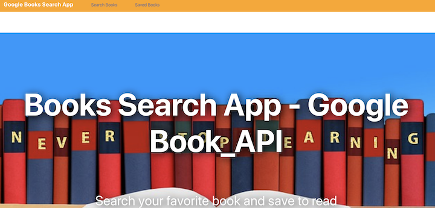

# Google Book Search App:

[Visit the link here]()

## Overview
This application was created with a new React-based Google Books Search app. This app construction used React components, helper/util functions, and utilized React lifecycle methods to query and display books based on user searches. We also use Node, Express and MongoDB so that users can save books to review or purchase later.

## Technical Requirements
* Javascript
* React.js
* JSX
* Express/Node.js
* MongoDB/Mongoose

## Create By:

Bee Pritchard @ [Github]()